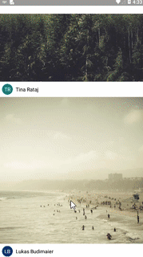

## Image Feed App Using React Native : From Fullstack React Native book

## Things learned:

- Creating well structrured components and passing props to them
- fetching image data from remote server
- Various styling tricks

## Screen Cast:

