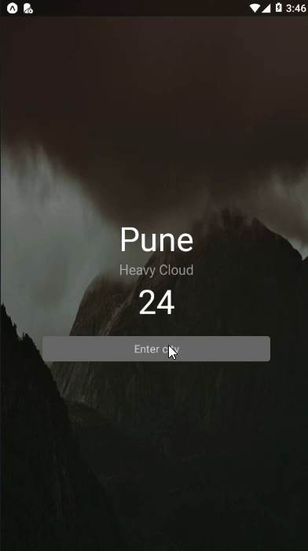

## Weather App Using React Native : From Fullstack React Native book

## Things learned:

- Creating class based components
- passing props from parent to child and vice versa
- Use of weather api to fetch weather data
- Designing modular component based layout
- Displaying conditional based components

## Screen Cast:

